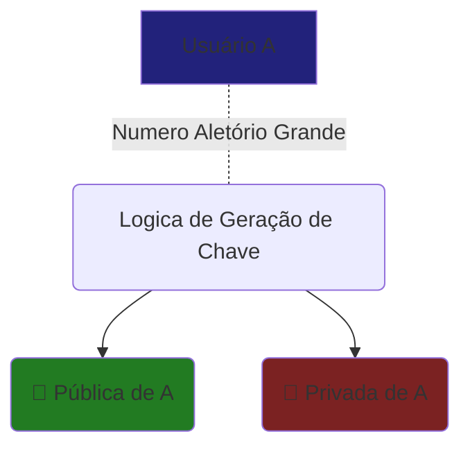
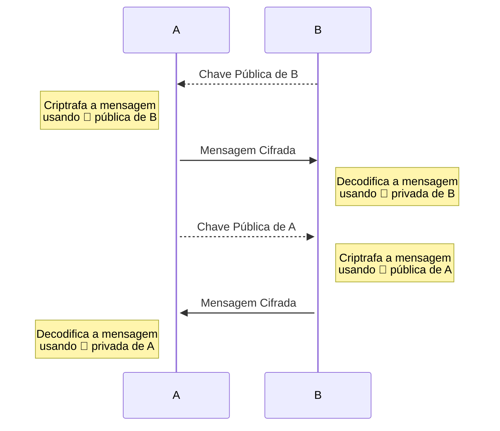

# Introdução Sobre Chaves Criptográficas 

## Chaves criptográficas 
Criptografia assimétrica ou criptografia de chave pública é qualquer sistema criptográfico que utiliza pares de chaves: 
### Chaves públicas
Tem como objetivo serem amplamente disseminadas. Distribuídas de forma aberta para que todos tenham acesso as mesmas.

### Chaves Privadas
São guardadas somente ao proprietário, não devem ser compartilhadas. Como tem o objetivo de serem utilizadas somente pelo dono, devem ser mantidas como se fossem senhas, sempre ocultas e  armazenadas de forma segura. 

### Geração de chaves 
As chaves são geradas de forma procedural dependendo do algoritmo utilizado para as mesmas, posteriormente iremos ver uma lista dos mais comuns. 
A logica de criação destes pares de chave sempre seguem uma ordem delineada para que exista a correlação entre ambas as chaves.

- Criação da chave para o usuário A

### Utilização de Chaves Assimétricas  
Abaixo um exemplo de utilização de chaves neste modelo.

## Tipos de Chaves Criptográficas Assimétricas
### [RSA - Rivest-Shamir-Adleman](https://pt.wikipedia.org/wiki/RSA_(sistema_criptogr%C3%A1fico))
**Rivest–Shamir–Adleman** normalmente abreviada como RSA é um dos esquemas de criptografia mais antigos e utilizados para transmissão segura de informações. 
Sua estrutura se baseia na fatoração de dois números primos grandes. A chave pública é então gerada a partir dessa fatoração e os números primos originais são mantidos em segredo como chave privada. Até o momento não há solução computacionalmente viável para reverter a fatoração dos números e essa premissa garante a segurança desta chave até o momento.

### [DSA - Digital Signature Algorithm](https://en.wikipedia.org/wiki/Digital_Signature_Algorithm)(em inglês)
Como o próprio nome já deixa claro DSA é utilizado como fim de assinatura digital, provendo assim:
- Autenticação da mensagem
  > Valida a autenticidade da mensagem confirmando a origem real da mesma.
- Integridade
  > Garante que a mensagem não foi modificada durante após a assinatura da mesma.
- Não Repúdio
  > O originador não pode reclamar que a mensagem não foi de sua autoria pois foi assinada com sua chave privada

O trecho abaixo (em inglês) detalha um ponto fraco deste tipo de chave onde pode se calcular a chave privada por conta da utilização do mesmo valor aleatório para cada assinatura visto que entropia, o sigilo e singularidade deste número são críticos para integridade do algoritmo.
> With DSA, the entropy, secrecy, and uniqueness of the random signature value $k$ are critical. It is so critical that violating any one of those three requirements can reveal the entire private key to an attacker. Using the same value twice (even while keeping $k$ secret), using a predictable value, or leaking even a few bits of $k$ in each of several signatures, is enough to reveal the private key $k$ .
> This issue affects both DSA and Elliptic Curve Digital Signature Algorithm ([ECDSA](https://en.wikipedia.org/wiki/ECDSA "ECDSA")) – in December 2010, the group _fail0verflow_ announced the recovery of the [ECDSA](https://en.wikipedia.org/wiki/ECDSA "ECDSA") private key used by [Sony](https://en.wikipedia.org/wiki/Sony "Sony") to sign software for the [PlayStation 3](https://en.wikipedia.org/wiki/PlayStation_3 "PlayStation 3") game console. The attack was made possible because Sony failed to generate a new random $k$ for each signature.
> 
> This issue can be prevented by deriving $k$ deterministically from the private key and the message hash, as described by [RFC](https://en.wikipedia.org/wiki/RFC_(identifier) "RFC (identifier)") [6979](https://datatracker.ietf.org/doc/html/rfc6979). This ensures that $k$ is different for each $H(m)$ and unpredictable for attackers who do not know the private key $x$.
> 
> In addition, malicious implementations of DSA and ECDSA can be created where $k$ is chosen in order to [subliminally](https://en.wikipedia.org/wiki/Subliminal_channel "Subliminal channel") leak information via signatures. For example, an [offline private key](https://en.wikipedia.org/wiki/Offline_private_key "Offline private key") could be leaked from a perfect offline device that only released innocent-looking signatures.

### [ECDSA - Elliptic Curve Digital Signature Algorithm](https://pt.wikipedia.org/wiki/ECDSA)
É uma variante da [[DSA]] utilizando criptografia de curva elíptica. Tem como maior vantagem a diminuição do tamanho da chave privada, uma chave pública de curva elíptica com 256-bits deve prover segurança comparável a uma chave pública RSA com 3072-bits. Vale lembrar que este tipo de chave é suscetível a vulnerabilidades como _Side-Channel Attacks_, _Backdoors_ entre outros sendo assim como a DSA um esquema que não é a prova de falhas pois depende da implementação correta e de boas práticas na sua utilização.

