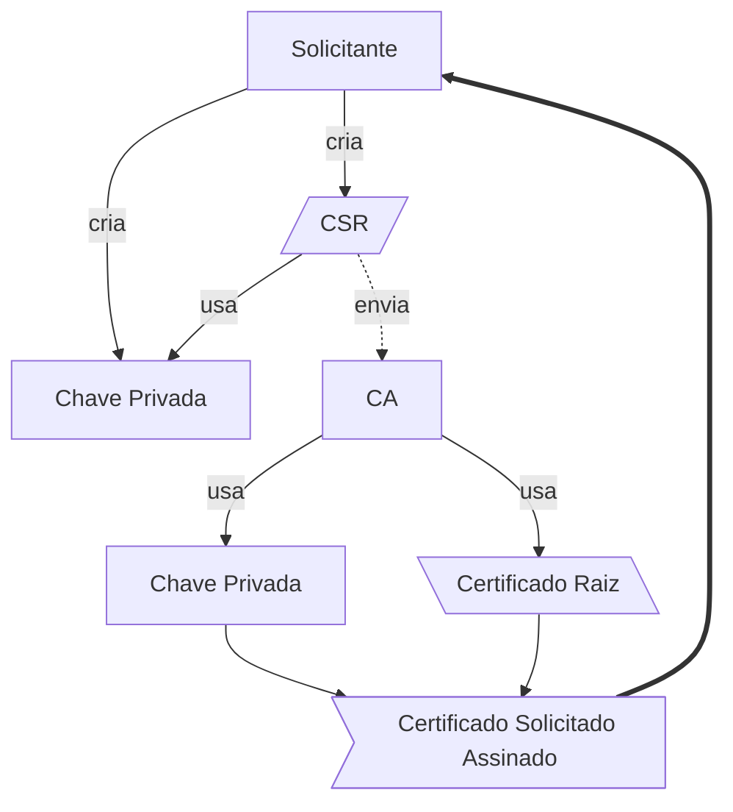

# Criando Um Novo Certificado

## Introdução

Um certificado auto assinado ou Self-signed normalmente é usado em ambientes de teste e desenvolvimento, a sua vantagem se da por não haver custos nem procedimentos dependentes de entidades externas para gerar um certificado utilizável em aplicações ou  autenticação. 

Por mais que seja prático não é recomendável sua utilização pois quebra a cadeia de segurança e não garante que nem a autenticidade nem ao sigilo da conexão. Uma ótima alternativa para um certificado auto assinado é o uso de ferramentas como [Let's Encrypt (letsencrypt.org)](https://letsencrypt.org/).

### Estrutura de Certificação

Para criar um certificado digital no formato X.509 precisamos de um Autoridade Certificadora ou CA (do inglês Certificate Authority) que será o emissor do certificado. Neste caso nós mesmos seremos a CA e o solicitante do Certificado. Para isso precisamos entender a estrutura do processo de certificação, neles usaremos:

- 2 Chaves privadas
    - Uma para o Solicitante
    - Uma para a CA
- 1 Certificado raiz(Root CA)
- 1 CSR (Certificate Signing Request)

Iremos usa-los na estrutura abaixo:


## Criando Uma Entidade Certificadora (CA)

Neste processo iremos utilizar o comando `openssl` e para manter tudo organizado iremos criar uma pasta chamada `certificado` na sua pasta de usuário e entraremos nela. Dentro dela criaremos a divisão para a Entidade Certificadora e outra para o solicitante.

```bash
mkdir ~/certificado
cd ~/certificado

mkdir {ca,solicitante}
```

### Gerando Certificado raiz da CA
Iremos armazenar todas as configurações num arquivo de texto onde poderemos reutiliza-las posteriormente.

Entre na pasta `ca` criada anteriormente e crie um arquivo de texto chamado `configCA`.
```bash
cd ca
touch configCA
```

Dentro deste arquivo cole o seguinte conteúdo e salve o mesmo.
```bash
## Nome do arquivo a ser gerado (Recomendado não alterar)
NOME="RaizCA" 

## Nome para o certificado, 
# normalmente o domínio do site
CN="exemplo.com.br"

## País 
PAIS="BR"

## Cidade
LOCALIDADE="Rio de Janeiro"

## Validade (em dias)
VALIDADE="365"
```

Voltando ao terminal execute os comandos abaixo para criar o certificado:
```bash
source configCA

openssl req -x509 -sha256 -days $VALIDADE -nodes \
            -newkey rsa:2048 \
            -subj "/CN=${CN}/C=${PAIS}/L=${LOCALIDADE}" \
            -keyout "$NOME.key" -out "$NOME.crt"
```

Após isso temos 3 arquivos, a configuração, a chave e o certificado Raiz da Entidade Certificadora.
![[Pasted image 20230526230349.png]]

Caso deseje inspecionar seu certificado pode usar o comando abaixo.
```bash
openssl x509 -noout -text -in $NOME.crt | less 
```
![[Pasted image 20230526230549.png]]


### Configuração Para Assinaturas
Essa configuração abaixo irá garantir que os dados do certificados sejam criados conforme desejado.
```bash
cat > cert.conf <<EOF
authorityKeyIdentifier=keyid,issuer
basicConstraints=CA:FALSE
keyUsage = digitalSignature, nonRepudiation, keyEncipherment, dataEncipherment
EOF
```

## Gerando CSR

Com uma entidade certificadora criada podemos partir para a parte do solicitante. Para isso vamos navegar para o diretório criado anteriormente.
```bash 
cd ~/certificado/solicitante
```

### Criando Chave Privada

Para criar a chave privada iremos utilizar uma chave RSA com 2048 bits, o comando abaixo irá criar um arquivo chamado `solicitante.key`.
```bash
openssl genrsa -out solicitante.key 2048
```

### Criando Configuração do CSR

O comando abaixo irá criar um arquivo com a configuração para gerar um novo certificado. Caso deseje poderá alterar os dados e parâmetros da solicitação para que atendam as necessidades do seu ambiente nas seções `dn` e `alt_names`.

```bash
cat > csr.conf <<EOF 
[ req ] 
default_bits = 2048 
prompt = no 
default_md = sha256 
req_extensions = req_ext 
distinguished_name = dn 

[ dn ] 
C = BR 
ST = São Paulo 
L = São Paulo 
O = Minha Organização 
OU = Meu Setor 
CN = meudominio.com.br 

[ req_ext ] 
subjectAltName = @alt_names 

[ alt_names ] 
DNS.1 = meudominio.com.br 
DNS.2 = www.meudominio.com.br 
IP.1 = 10.1.1.10
IP.2 = 192.168.1.10 
EOF
```

Edite o arquivo para ajustar os parâmetros, para os campos da seção `alt_names` podem ser criadas novas entradas para domínios e endereços IP, só é preciso seguir o padrão `DNS.n` ou  `IP.n` onde `n` é o número da entrada, a primeira entrada deve ser a de número 1. Um exemplo abaixo da seção com 3 endereços IP e um domínio.
```ini
[ alt_names ]
DNS.1 = guia-ti.hev.dev.br
IP.1 = 10.1.1.10
IP.2 = 10.2.1.10
IP.3 = 10.3.1.10
```

Com a configuração criada vamos usar o comando abaixo para gerar uma Solicitação de Assinatura de Certificado (CSR).
```bash
openssl req -new -key solicitante.key -out solicitante.csr -config csr.conf
```

Na pasta devemos ter agora três arquivos, `csr.conf`, `solicitante.key` e `solicitante.csr`.

## Assinando o Certificado

Com os dados anteriores gerados e a CSR com os dados ajustados podemos gerar o certificado com o comando abaixo.
```bash
openssl x509 -req -in solicitante.csr -CA ../ca/$NOME.crt \
            -CAkey ../ca/$NOME.key -CAcreateserial -out solicitante.crt \
            -days $VALIDADE -sha256 -extfile ../ca/cert.conf \
            -copy_extensions copy
```
![[Pasted image 20230527000133.png]]

## Validando o certificado Assinado

Para confirmar os dados do certificado assinado pode usar o comando abaixo.
```bash
openssl x509 -noout -text -in solicitante.crt | less 
```
![[Pasted image 20230526234008.png]]

Depois desta etapa poderá utilizar o conjunto de chave e certificados do solicitante em sua aplicação. Lembre-se bem que a chave privada deve sempre ser armazenada de forma segura.


